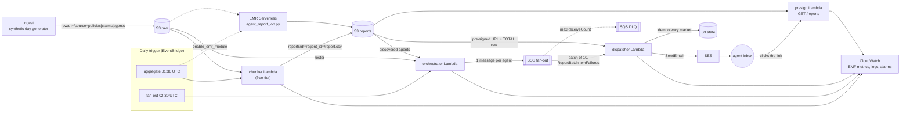

# Agent-wise Report Distribution System

An insurance company's field agents need their own numbers every morning: the policies they wrote,
the premium and commission they earned, and the claims filed against their book. Doing that by hand
does not scale, and emailing a CSV attachment to thousands of agents is not acceptable either — so
the pipeline builds one CSV per agent, drops it in S3, and emails a short-lived **pre-signed link**
instead. This repository is a clean-room rebuild of that pipeline with synthetic data: ingestion →
per-agent aggregation → fan-out → delivery, with the paid AWS path (EMR Serverless + Spark) and a
free-tier path (Lambda chunker) that produce byte-identical reports.

## Architecture



## Tech stack

| Layer | Choice | Why |
| --- | --- | --- |
| Language | Python 3.11 | the resume stack; single language across Lambdas and Spark |
| Aggregation | PySpark 3.5 on EMR Serverless (optional) | shuffle-scale aggregation, no cluster to babysit |
| Free-tier aggregation | Lambda chunker (pure Python, streamed) | same output, zero cost, for days that fit in a Lambda |
| Storage | S3 (raw / processed / reports) with lifecycle policies | cheap tiering, versioning, pre-signed access |
| Fan-out | SQS + dead-letter queue | one message per agent, partial-batch retries |
| Delivery | SES (plain + HTML, configuration set, tags) | transactional email with per-agent personalisation |
| Config/IaC | Terraform 1.6+ (AWS provider 5.x) | every resource in this diagram is real HCL |
| Tests | pytest + moto (`mock_aws`) | the whole pipeline runs offline with no AWS account |
| CI | GitHub Actions | lint, typecheck, tests, `terraform validate`, e2e |

## How it works

1. **Ingest** (`agent_reports.ingest`) writes a deterministic synthetic day into
   `raw/dt=YYYY-MM-DD/source=agents|policies|claims/part-NNNNN.csv` — ≥50k rows by default, seeded,
   no PII.
2. **Aggregate** — either the **chunker** Lambda (free tier: streams the raw partitions and writes
   one CSV per agent) or the **PySpark job** (`emr/jobs/agent_report_job.py`, deployed to EMR
   Serverless). Both write `reports/dt=YYYY-MM-DD/agent_id=AGT-000123/report.csv`, one `DETAIL` row
   per policy sorted by policy id plus one `TOTAL` row.
3. **Fan out** — the **orchestrator** reads the day's roster and the set of agents that actually have
   a report, then `SendMessageBatch`es one message per agent (retrying the entries SQS rejects) and
   writes `state/runs/dt=YYYY-MM-DD/manifest.json`.
4. **Deliver** — the **dispatcher** takes an idempotency lease for `(date, agent)`, reads the report's
   `TOTAL` row for the email copy, mints a pre-signed URL (default TTL 1 hour), sends the SES message,
   and records the delivery. Retryable failures come back as `batchItemFailures`; after
   `maxReceiveCount` receives SQS moves the message to the DLQ. Unparseable payloads are quarantined
   to `state/quarantine/...` instead of looping.
5. **Re-issue** — the **presign** Lambda (`GET /reports?agent_id=…&date=…`) hands an agent a fresh
   link when the emailed one has expired. Authorisation is deny-by-default: agents may read their own
   report, `reports-admin`/`ops`/`finance` may read any.
6. **Observe** — every stage emits CloudWatch EMF metrics (`EmailsSent`, `ReportsWritten`,
   `DispatchLatencyMs`, `ReportAgeSeconds`, …) plus JSON logs; Terraform wires metric filters,
   alarms (DLQ depth, dispatcher errors, report lag) and a dashboard.

## Setup

```bash
# Python env (uv; python3 is not required to exist)
uv venv .venv --python 3.11
uv pip install --python .venv/bin/python -r requirements-dev.txt
uv pip install --python .venv/bin/python -e . --no-deps      # or: make setup

# Spark tests need a JVM; on Windows also Hadoop's winutils.exe + hadoop.dll
export JAVA_HOME=/path/to/jre21
export HADOOP_HOME=/path/to/hadoop        # Windows only (bin/winutils.exe, bin/hadoop.dll)

# Whole pipeline offline (moto): no AWS account, no credentials, no network
python scripts/e2e_local.py --rows 5000
```

Environment variables (all optional, defaults in `agent_reports.common.settings`; see
`.env.example`): `AGENT_REPORTS_REGION`, `AGENT_REPORTS_RAW_BUCKET`,
`AGENT_REPORTS_PROCESSED_BUCKET`, `AGENT_REPORTS_REPORTS_BUCKET`, `AGENT_REPORTS_AGENT_QUEUE_URL`,
`AGENT_REPORTS_DLQ_URL`, `AGENT_REPORTS_SES_SENDER`, `AGENT_REPORTS_SES_CONFIGURATION_SET`,
`AGENT_REPORTS_PRESIGN_TTL_SECONDS`, `AGENT_REPORTS_SQS_BATCH_SIZE`, `AGENT_REPORTS_LOG_LEVEL`,
`AGENT_REPORTS_ENDPOINT_URL` (LocalStack), `AGENT_REPORTS_LOCAL_ROOT` (filesystem-only mode).

## API / socket reference

There is no long-lived server; the surfaces are the Lambda invocations and one HTTP route.

| Surface | Shape | Returns |
| --- | --- | --- |
| `chunker.handler` | `{"report_date": "YYYY-MM-DD", "shard": {"index": 0, "of": 4}}` or `{"agent_ids": [...]}` | `agents_planned`, `reports_written`, `rows_read`, `duration_seconds` |
| `orchestrator.handler` | `{"report_date": "YYYY-MM-DD"}` (optional `agent_ids`, `require_report`) | `agents_discovered`, `messages_enqueued`, `partial_batch_failures`, `manifest_uri` |
| `dispatcher.handler` | SQS event (`Records[].body` = JSON below) | `{"batchItemFailures": [{"itemIdentifier": "<messageId>"}]}` |
| `presign.handler` | `GET /reports?agent_id=AGT-000123&date=2026-09-20` (+ JWT claims or `X-Caller-Agent-Id`) | `200 {"url", "expires_at", "expires_in", "agent_id", "report_date", "report_key"}`; `400/401/403/404` |
| SQS message body | `{"agent_id", "report_date", "recipient", "agent_name", "region", "branch"}` | consumed by the dispatcher |
| Report object | `reports/dt=<date>/agent_id=<id>/report.csv` | 17-column CSV, `DETAIL` rows + one `TOTAL` row (see `docs/SCHEMA.md`) |

## Testing

```bash
make lint          # ruff check + ruff format --check
make typecheck     # mypy (src, scripts, tests) - zero errors
make test          # pytest: unit + moto integration + real local Spark
make coverage      # pytest with --cov-fail-under=85
make tf-validate   # terraform fmt -check + init -backend=false + validate
make e2e           # scripts/e2e_local.py: whole pipeline offline, prints a report
```

The suite needs no AWS credentials: moto mocks S3/SQS/SES/CloudWatch and the Spark tests run a real
`local[2]` session against the filesystem. `pytest -m "not requires_jvm"` skips the Spark tests on a
machine without a JVM (they print a loud banner when they do skip, and CI installs Java so they run).

## Measured results

All numbers below were produced on this machine by the commands in VERIFY.md (Windows 11, Python
3.11.16, Temurin 21 JRE, Terraform 1.9.8). Full transcripts, including the raw `pytest --cov` table
and the e2e output, are in [VERIFY.md](VERIFY.md).

| Measurement | Result | Command |
| --- | --- | --- |
| Test suite | 339 passed, 0 failed, 0 skipped | `pytest tests -q` |
| Coverage of `agent_reports` | 92% statements, 92% branches (136 of 2,396 statements missed) | `pytest tests --cov=agent_reports` |
| Lint / format / types | ruff clean, `ruff format --check` clean, mypy 0 errors | `make lint typecheck` |
| Terraform | `fmt -check` and `validate` clean (root module + EMR module) | `make tf-validate` |
| Dataset generation | 52,471 rows in 0.83 s (38% headroom over the 50k target) | `agent-reports generate --rows 50000` |
| Offline e2e | 5,000-row day: 381 agents, 381 reports, 381 emails, queue drained, pre-signed link verified byte-for-byte | `make e2e` |
| Offline e2e at scale | 50,000-row day: 52,471 rows, 3,805 agents, 3,805 reports, 3,805 emails, queue drained, link verified, 960 s wall (moto-bound) | `python scripts/e2e_local.py --rows 50000 --shards 4` |
| Spark vs chunker | byte-identical reports for all 40 agents, `local[2]`, real shuffle | `pytest tests/integration/test_spark_job.py` |
| Spark job runtime | the 5-test Spark module runs in 25-60 s including JVM + session start (`5 passed in 60.35s` on the last run; JVM startup dominates and varies) | `pytest tests/integration/test_spark_job.py -q` |

Exact commands, raw output and the honest gap list are in [VERIFY.md](VERIFY.md).

## Limitations and what is not built yet

- **SES is in the sandbox until production access is granted.** Both the sender and every recipient
  must be verified; the offline run verifies the synthetic `@example.com` agents for this reason.
- **The EMR path is deployed but not executed on AWS.** `terraform validate` and the local Spark run
  are real; an actual EMR Serverless job run needs an AWS account and was not performed here.
- **The `presign` HTTP API has no authorizer wired to a real identity provider.** The function reads
  JWT claims if present and denies by default, but a JWT authorizer (Cognito or equivalent) still has
  to be attached in Terraform for production use.
- **No attachment path.** Delivery is link-only by design; agents without web access are out of scope.
- **CloudWatch dashboards/alarms are created but never fired here.** Alarm thresholds are reasoned,
  not battle-tested against real traffic.
- **Single-region, no cross-region replication, no PITR.** The lifecycle policies are the only data
  protection beyond versioning.
- **The synthetic data is not a statistical model of a real book.** Product mix, severity and claim
  incidence are plausible, not calibrated.
- **`agent_reports.lambda_handlers` is the package name** (`lambda` is a Python keyword); the deployed
  function names keep the `-orchestrator` / `-dispatcher` / `-presign` / `-chunker` convention.

## License

MIT — see [LICENSE](LICENSE).
